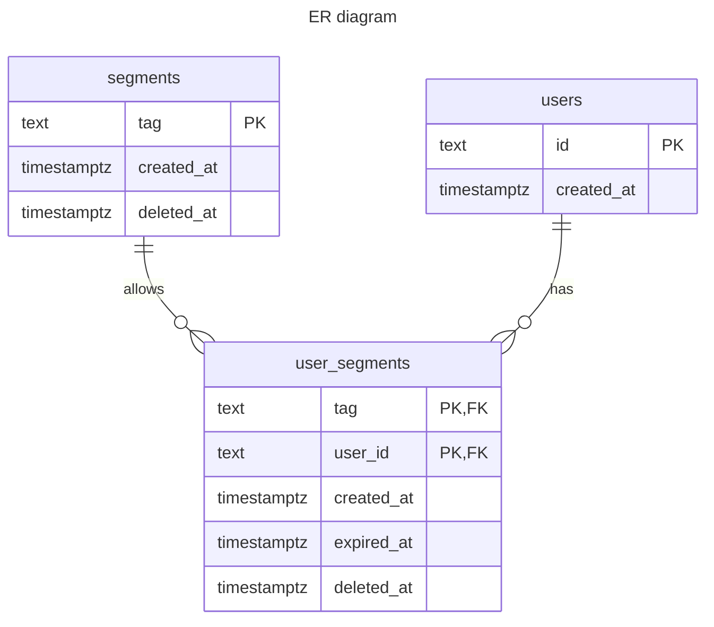

## Segment service

```mermaid
---
    title: ER diagram
---
erDiagram
    segments {
        text tag PK
        timestamptz created_at
        timestamptz deleted_at
    }
    
    users {
        text id PK
        timestamptz created_at
    }

    user_segments {
        text tag PK, FK
        text user_id PK, FK
        timestamptz created_at
        timestamptz expired_at
        timestamptz deleted_at
    }

    segments ||--o{ user_segments: allows
    users ||--o{ user_segments: has
```