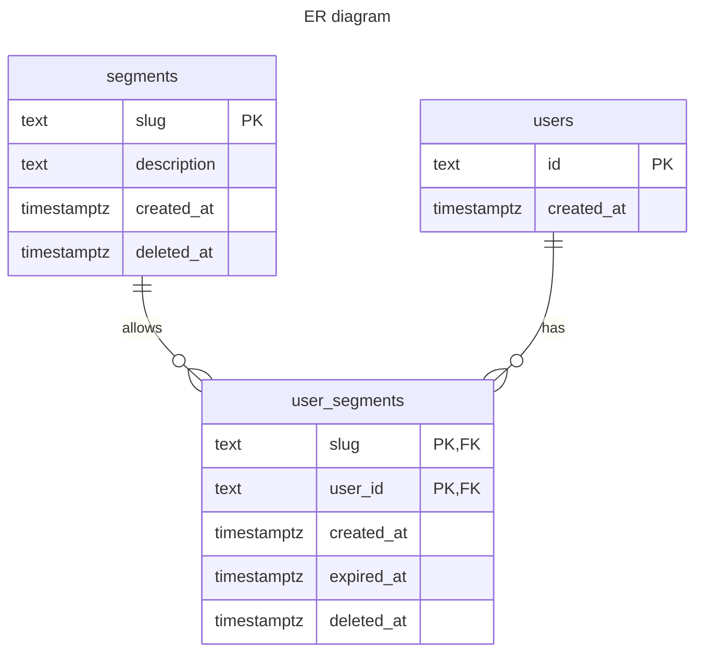

## Avito segment service
[](https://github.com/dupreehkuda/avito-segments/actions/workflows/test.yml)
[](https://github.com/dupreehkuda/avito-segments/actions/workflows/lint.yml)


#### Запуск

Сервис задеплоен по адресу avito.1145267-cv99614.tw1.ru, 
конфиг прописан в [config.prod.yml](configs/config.prod.yml).

Можно запустить линтер и тесты командами 
`make lint` и `make test` соответственно.

Для локального запуска – `make compose-up`, 
поднимется postgres и сам сервис.

Деплой происходит с помощью Github actions. Есть 4 экшена: 
[lint](.github/workflows/lint.yml), 
[test](.github/workflows/test.yml), 
[build](.github/workflows/build.yml) 
и [deploy](.github/workflows/deploy.yml).
Этап build собирает docker image и пушит его на ghcr.io.
Этап deploy стягивает image на сервер и запускает его.

Задеплоен сервис как и локально с помощью docker-compose 
с _**контейнером postgres**_, так конечно делать не стоит, 
но в рамках тестового решил оставить так.

#### Использование

Собрал [postman-коллекцию](avito.postman_collection.json) 
из запросов как к деву, так и к проду. 
Также есть и документация [swagger](api/segments.yml).

#### Технологии

В качестве http роутера решил использовать labstack/echo 
для более удобной обработки ошибок, обычно использую chi.

В качестве драйвера и интерфейса базы использую jackc/pgx.

Для более гибкого и удобного построения запросов
использовал Masterminds/squirrel.

Также решил использовать uber/fx. 
Не считаю что для такого достаточно маленького проекта 
нужен такой dependency injection, однако решил попробовать 
uber/fx так как с google/wire уже работал.

В качестве логера использовал uber/zap.

Тестировал с помощью stretchr/testify и uber/mockgen.

#### Дополнительные задания

При выполнении дополнительных заданий опирался на то, 
что спрос на сервис пока будет небольшой.

С отчетами все довольно просто.
Делается запрос на формирование отчета, 
отчет формируется, ответом возвращается ссылка на 
скачивание CSV файла, который создается в папке reports.

TTL для сегментов решил реализовать с помощью поля `expired_at` 
в базе. 
После истечения [select запрос](/internal/repository/users.go:77) 
просто не выберет эти сегменты, а данные для аналитики останутся.

Сегменты с процентами к сожалению не реализовал. 
Было много идей, однако большинство отпадали из-за проблем, которые 
возникли бы при будущем масштабировании.

В конце концов, был вариант дополнить запрос выборки сегментов пользователя из 
базы еще одним запросом, который будет проверять хэш айди или даты добавления юзера
и доставать подходящие по проценту сегменты. 
Примерный запрос:
```postgresql
SELECT *
FROM segments segs
WHERE mod(to_number(substr(hash_numeric('userID'), 2)), 100) <= segs.percentage
```

#### Возникшие вопросы
##### Валидация
Так как валидацию оставили на усмотрение участников, userID 
должен быть валидным uuid.

##### Несуществующий пользователь
При запросе на добавление сегментов пользователю, 
срабатывает [триггер](migration/000001_init_mg.up.sql) 
на добавление пользователя в таблицу users, если его там еще нет.

##### Несуществующий сегмент
При запросе на добавление/удаление сегментов пользователю решил
отдавать ошибку, если хотя бы одного сегмента из массива не 
существует. 
Посчитал, что так будет достаточно явно: если сегмента нет, 
он не добавится и не будет висеть мертвым грузом, а клиент 
перепроверит данные/запишет ошибку.

